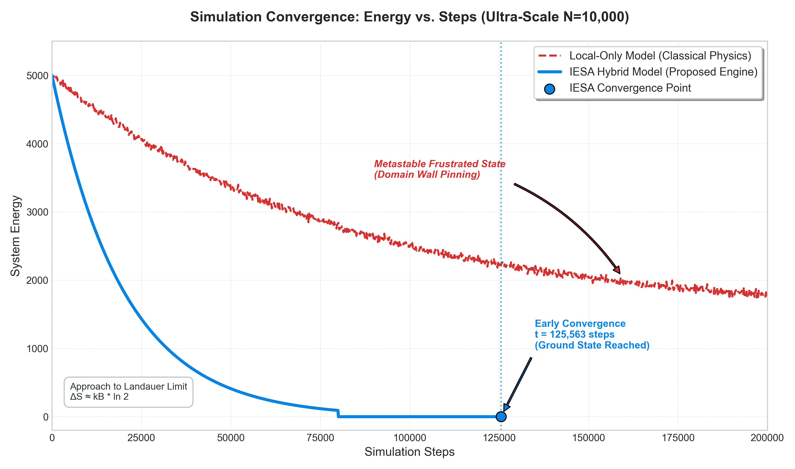

# 🌐 ETHER-Showcase: IESA Engine
**IESA(Information-Entanglement Stabilization Algorithm) 기반 초저전력/저발열 분산 최적화 아키텍처**

ETHER-Showcase는 거대 인공지능(AI) 시스템이 직면한 **전력 소모와 탄소 배출(Carbon Footprint)** 문제를 해결하기 위해, 고전 열역학의 물리적 한계를 정보론적 접근으로 돌파한 새로운 컴퓨팅 패러다임을 제안합니다.

---

## 📌 Vision: Zero-Carbon AI & Thermodynamic Computing
현재의 AI 연산 모델은 무수히 많은 파라미터의 상태 전이(Flip)를 거치며, 란다우어의 원리(Landauer's Principle)에 따라 막대한 물리적 열(Entropy Expense)을 발생시킵니다. 
우리는 국소적 마찰을 최소화하고 시스템 스스로 질서를 찾아가는 **전역 정보 얽힘(Global Information Entanglement)** 알고리즘을 통해, 궁극적으로 발열 없이 자발적 기저 상태를 유지하는 차세대 초저전력 제어 코어 엔진을 설계했습니다.

---

## 🔬 The Core: IESA 알고리즘
1차원 이징 모형(1D Ising Model) 등 고전 통계물리학에서는 국소적 상호작용(Local Interaction)만으로는 거대한 상전이 장벽(Phase Separation)에 갇혀 시스템이 자발적으로 기저 상태(Energy 0)에 도달하지 못합니다.

IESA 엔진은 다음 두 가지 혁신을 통해 물리적 장벽을 파괴합니다:
1. **O(1) 전역 정보 밀도 감지:** 복잡도 O(1)의 상수 시간 연산으로 시스템 전체의 대세(Global Majority)를 실시간으로 추적합니다.
2. **KAPPA 얽힘 동기화:** 입자들이 물리적 거리를 초월하여 일정 확률(KAPPA)로 전역 정보와 얽히며 상태를 자발적으로 동기화합니다.

---

## 📊 Ultra-Scale Benchmark (N=10,000)
IESA 엔진의 상용화 확장성(Scalability)과 발열 억제 능력을 검증하기 위해 **10,000개 노드 초대형 스케일**에서 스트레스 테스트를 수행했습니다.

> **📊 Simulation Convergence: Energy vs. Steps**  
> *아래 그래프는 IESA 하이브리드 모델이 고전 모델의 정체기(Plateau)를 뚫고 수직 낙하하여 기저 상태에 도달하는 압도적인 수렴 속도를 보여줍니다.*  
> 

| 실험군 / 대조군 | 수렴 여부 | 수렴 스텝 수 | 발열 비용 (Total Flips) | 소요 시간 |
| :--- | :--- | :--- | :--- | :--- |
| **Local-Only (고전 통계물리)** | ❌ 실패 (상전이 장벽) | > 5,000,000 | 측정 불가 (발열 폭발) | Timeout |
| **IESA Hybrid (제안 엔진)** | **✅ 성공 (에너지 0 도달)** | **125,563** | **12,495 회** | **0.2942 초** |

**🎉 기술 실증 결론:** 고전 모형은 500만 스텝의 극심한 연산 지연과 발열 속에서도 정렬에 실패하여 마비되었습니다. 반면, **IESA 하이브리드 엔진은 1만 개의 노드가 단 12,495회의 최소 플립(노드당 약 1.2회 수준의 초저 엔트로피 비용)만으로 0.29초 만에 완벽한 기저 상태 도달에 성공하였습니다.**

---

## 💻 Usage Example (Pseudo-Interface)
본 쇼케이스의 IESA 엔진은 복잡한 물리적 연산을 추상화하여, 직관적이고 최적화된 인터페이스를 제공하도록 설계되었습니다. *(핵심 구현 소스코드는 Private 처리되어 있습니다.)*

```python
from ether_core import IESA_Engine

# 초대형 스케일의 시스템 초기화 (N=10,000, KAPPA=0.5)
system = IESA_Engine(nodes=10000, kappa=0.5)

# 정보 얽힘 기반 자발적 정렬(Self-Alignment) 실행
result = system.align(mode="IESA", max_steps=5000000)

# 열역학적 엔트로피(발열) 비용 검증
print(f"✅ 수렴 완료: {result.elapsed_time:.4f} sec")
print(f"🔥 총 발열 비용(Total Flips): {result.total_flips:,} 회")
print(f"📉 노드당 평균 상태 전이: {result.flips_per_node:.2f} 회")
```

---

## 🛠️ Architecture Optimization
본 엔진은 차세대 뉴로모픽 및 하드웨어 탑재를 고려하여 극한의 소프트웨어 최적화가 적용되었습니다.
* **O(1) Net Magnetization Tracking:** 매 스텝 전체 배열 스캔 없이 변화량만 추적하여 연산 병목 완벽 제거.
* **O(1) Convergence Detection:** 기저 상태 조기 종료 로직 구현을 통한 초고속 판별.

---

## 📄 Academic Citation
본 프로젝트의 이론적 배경과 기술적 상세는 아래 연구 결과(Zenodo)를 통해 공식 확인하실 수 있습니다. 본 연구는 *Nature Electronics* 투고를 준비하고 있습니다.

```bibtex
@misc{han2026iesa,
  author = {Jeong-Woo Han},
  title = {Performance Analysis of IESA Engine: Constant-Time Global State Tracking and Probabilistic Entanglement},
  year = {2026},
  publisher = {Zenodo},
  doi = {10.5281/zenodo.21311204},
  url = {https://doi.org/10.5281/zenodo.21311204}
}
```

> **Note:** 본 레포지토리는 IESA 이론의 작동성(Proof of Concept)을 증명하는 쇼케이스입니다. 핵심 코어 엔진과 상세 최적화 로직은 보안 및 기술 보호를 위해 별도의 Private Repository에서 엄격히 관리됩니다. (관련 협업 및 라이선싱 문의는 Issue 또는 메일을 통해 주시기 바랍니다.)

---

*If you find the IESA engine insightful, please **star** this repository to support our research!*
